<!-- 

-->
<!-- 

-->

# 💫 About Me:
### Software Engineer🔹Mentor At @topmate.io🔹Software Developer🔹Building @CryptoMinds Community🔹MERN Stack
-  Open Source Contributor from **India** 🇮🇳
-  I'm a **Student** and **Web Developer**
-  I’m currently working on **Web Development & Freelancing** 
-  I’m currently learning **TypeScript And NextJS**
-  I’m looking to collaborate with **Open Source Enthusiasts** and **Developers**
-  **2025 Goals:** Learn **Machine Learning**, **AI**, **Full Stack NextJS & TypeScript** And strengthen **DSA**

<h1>Socials </h1>

  
  
  
  
  
  
  
   

<!-- 
 
-->
 
# <b> Skills</b> 💻

### 🛠️ Languages & Frameworks

<table align="center" class="table table-dark">
  <tr>
    <td align="center" width="90"> C++</td>
    <td align="center" width="90"> C</td>
    <td align="center" width="90"> Java</td>
    <td align="center" width="90"> Python</td>
    <td align="center" width="90"> JavaScript</td>
    <td align="center" width="90"> TypeScript</td>
    <td align="center" width="90"> Prompt Eng.</td>
    <td align="center" width="90"> LangChain</td>
  </tr>

  <tr>
    <td align="center" width="90"> OpenAI API</td>
    <td align="center" width="90"> RAG</td>
    <td align="center" width="90"> PyTorch</td>
    <td align="center" width="90"> React</td>
    <td align="center" width="90"> Next.js</td>
    <td align="center" width="90"> Node.js</td>
    <td align="center" width="90"> Express</td>
    <td align="center" width="90"> FastAPI</td>
  </tr>

  <tr>
    <td align="center" width="90"> Django</td>
    <td align="center" width="90"> Prisma</td>
    <td align="center" width="90"> Redux</td>
    <td align="center" width="90"> React Query</td>
    <td align="center" width="90"> HTML</td>
    <td align="center" width="90"> CSS</td>
    <td align="center" width="90"> Tailwind</td>
    <td align="center" width="90"> Bootstrap</td>
  </tr>

  <tr>
    <td align="center" width="90"> Vite</td>
    <td align="center" width="90"> SSR</td>
    <td align="center" width="90"> Hybrid Rendering</td>
    <td align="center" width="90"> System Design</td>
    <td align="center" width="90"> API Optimization</td>
  </tr>
</table>

### ☁️ Cloud & DevOps
<table align="center" class="table table-dark">
  <tr>
    <td align="center"> AWS</td>
    <td align="center"> Azure</td>
    <td align="center"> Docker</td>
    <td align="center"> Kubernetes</td>
    <td align="center"> GitHub Actions</td>
    <td align="center"> GitLab Actions</td>
    <td align="center"> Netlify</td>
    <td align="center"> Vercel</td>
  </tr>
</table>

### 🗄️ Databases

<table align="center" class="table table-dark">
  <tr>
    <td align="center"> MongoDB</td>
    <td align="center"> Firebase</td>
    <td align="center"> Redis</td>
    <td align="center"> PostgreSQL</td>
    <td align="center"> Vector DB</td>
    <td align="center"> Vector Search</td>
    <td align="center"> ChromaDB</td>
  </tr>
</table>

### ⚙️ Tools & Utilities

<table align="center" class="table table-dark">
  <tr>
    <td align="center"> Git</td>
    <td align="center"> GitHub</td>
    <td align="center"> Copilot</td>
    <td align="center"> VS Code</td>
    <td align="center"> Visual Studio</td>
    <td align="center"> Postman</td>
    <td align="center"> Figma</td>
    <td align="center"> NPM</td>
  </tr>

  <tr>
    <td align="center"> Linux</td>
    <td align="center"> Bash</td>
    <td align="center"> Regex</td>
    <td align="center"> Notion</td>
  </tr>
</table>

### 🌐 Social & Community

<table align="center" class="table table-dark">
  <tr bg-dark>
    <td align="center" width="90">
      
       Stackoverflow
    </td>
    <td align="center" width="90">
      
       Discord
    </td>
    <td align="center" width="90">
      
       Instagram
    </td>
    <td align="center" width="90">
      
       LinkedIn
    </td>
  </tr>
</table>

 
<!-- 
 
-->
<!--

Top Repositories

    
    
    
    
    
    

 
-->
<!--
# 🚀 Top Repositories

    
    
    

    
    
    

 
-->
<!--
======================================================
📊 GitHub Over Time (Disabled Section)

This section contains:
- GitHub overall stats
- GitHub streak stats
- Optional alternative streak providers
- Decorative divider animation

Temporarily commented out to keep the README clean.
Uncomment the entire block when needed.
======================================================

<table>
  <tr>
    <td>
      
    </td>

    <td>
      
    </td>
  </tr>
</table>

 
 
     <!--
    <td>
      Top Languages (disabled)
      
      
    </td>
    -->

 # 🔝 Most Used Languages

<table>
  
  <tr>
    <td>
      
    </td>
      <td>
      
    </td>
  </tr>
</table>

<table>
  <tr>
    <td>
               
<!--          -->
    </td>
    <td>
      
    </td>
    <td>
      
    </td>
  
  </tr>
</table>

 
<!-- 
 
-->

# ⚡Activity Graph

   

 
<!-- 
 
-->

# ⚡ Achievements & Stackoverflow
<table>
  <tr>
    <td>
<!--        -->
      
    </td>
    <td rowspan="2">
      
    </td>
  </tr>
  <tr>
     <td align="center">
      
    </td>
  </tr>
</table>

 
<table>
  <tr>
    <!-- Uncomment and use this if you want to display the Stack Overflow card -->
    <!-- <td>
      
    </td> -->
    <td>
      
    </td>
    <td>
      
    </td>
  </tr>
</table>
 
<!-- 
 
-->

 # 🔝 Top Contributed Repo & Leetcode
<table>
  <tr>
    <td>
      
    </td>
    <td>
<!--      -->
<!--        -->
        
    </td>
  </tr>
</table>
 
<!-- 
 
-->

<h1>HacktoberFest Badge</h1>

 
<!-- 
 
-->
<!--
# ⌛ GitHub Trophies

 
-->
<!-- 
 
-->
<!-- 
 <h1> GitHub Stats &  GitHub Most Used Packages</h1>
 
<table>
  <tr>
    <td>
      
    </td>
    <td>
      
    </td>
  </tr>
</table>
 
<!-- 
 
-->
<!--
# ⌛GitHub Languages & Topic Over Time
<table>
  <tr>
    <td>
      
    </td>
    <td>
      
    </td>
  </tr>
</table>
 
-->
<!-- 
 
-->

# 🔥 3D Contributions Chart

<picture>
  <source media="(prefers-color-scheme: dark)" srcset="https://raw.githubusercontent.com/dpvasani/dpvasani/output-3d-contrib/night.svg" />
  <source media="(prefers-color-scheme: light)" srcset="https://raw.githubusercontent.com/dpvasani/dpvasani/output-3d-contrib/day.svg" />
  
</picture>

 

  

 
<!-- 
 
-->

<!--

-->

<!--
## ✍️ GitHub 2024 Unwrapped

 
-->
<!-- 
# 📊 GitHub 2024
<table style="width:100%; table-layout:fixed;">
  <tr>
    <td style="width:50%;">
      
    </td>
    <td style="width:50%;">
      
    </td>
  </tr>
</table>

 

# ✍️ GitHub 2024 Unwrapped

 

-->

 

  

<blockquote>

<strong>"Keep coding, stay innovative, and build the future! ✨"</strong>

</blockquote>

    

 

## ✍️ Random Dev Quote 

---

---

